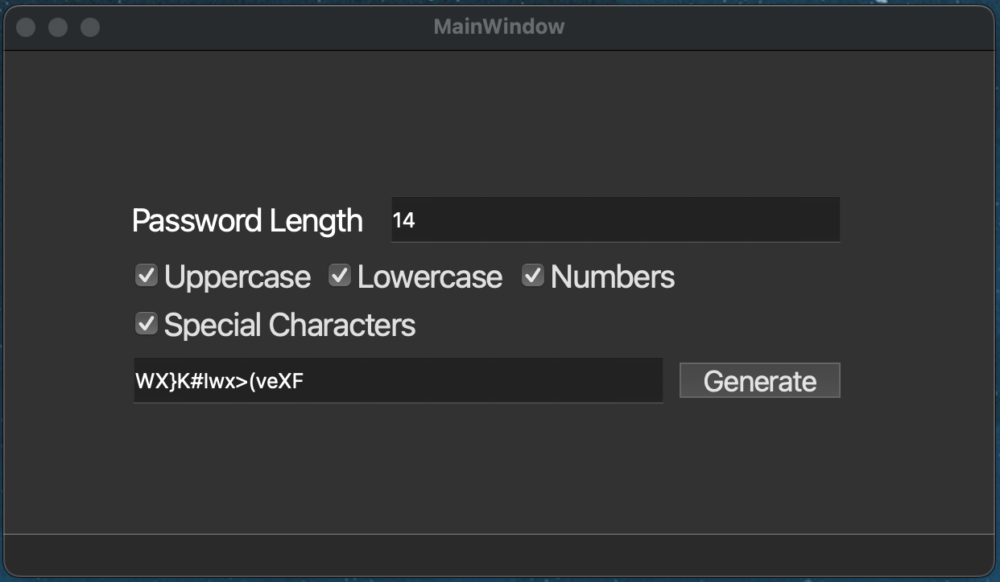

# Password Generator Application




This is a simple password generation app built using Qt. The application allows users to generate random passwords based on selected criteria such as length, inclusion of uppercase letters, lowercase letters, numbers, and special characters.

## Features

- Set the desired length of the password (1-50 characters).
- Include uppercase letters.
- Include lowercase letters.
- Include numbers.
- Include special characters.
- Generate and display the password.

## Requirements

- Qt 5 or 6
- CMake 3.16 or higher
- C++17 compatible compiler

## Building the Project

1. Clone the repository:
    ```sh
    git clone <repository-url>
    cd PasswordGeneratorGUI
    ```

2. Create a build directory and navigate into it:
    ```sh
    mkdir build
    cd build
    ```

3. Run CMake to configure the project:
    ```sh
    cmake ..
    ```

4. Build the project:
    ```sh
    cmake --build .
    ```

## Running the Application

After building the project, you can run the application from the build directory:
```sh
./PasswordGeneratorGUI
